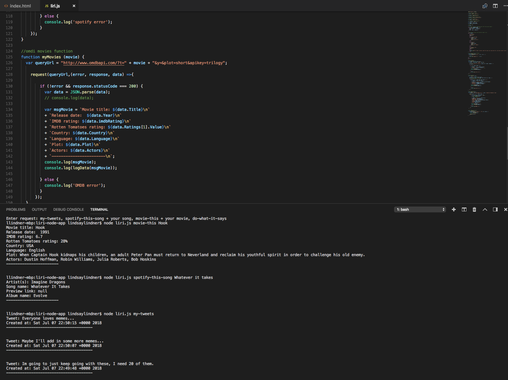

# liri-node-app
LIRI is like iPhone's SIRI. However, while SIRI is a Speech Interpretation and Recognition Interface, LIRI is a Language Interpretation and Recognition Interface. LIRI will be a command line node app that takes in parameters and gives you back data.

## Apps ##

**Liri Bot Terminal**

## Tools ##

**Technology Used**
* Node.js
* Javascript
* npm Spotify library
* npm Twitter library
* OMDB API
